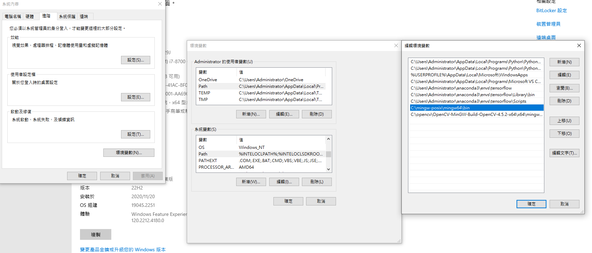

Opencv_VSCODE環境設定
======

### MinGW安裝

+ 若先前有裝過MinGW，先打開CMD輸入看看自己的MinGW版本是不是POSIX，若為win32刪掉重下載


```
網址 https://sourceforge.net/projects/mingw-w64/files/#mingw-w64-gcc-8-1-0

MinGW-W64 GCC-8.1.0
- x86_64-posix-sjlj
- x86_64-posix-seh (下載這個)
- x86_64-win32-sjlj
- x86_64-win32-seh
- i686-posix-sjlj
- i686-posix-dwarf
- i686-win32-sjlj
- i686-win32-dwarf

```

+ 接下來將下載後檔案存入C槽，將bin環境變數加入



+ 加入後查看gcc版本是否為POSIX，打開CMD再打一次

```
gcc- v

```

### Opencv文件下載

+ 將github上ZIP檔案下載下來，那是人家已經動態連結編譯好的函式庫，下載好後也是一樣將檔案放在C槽，接下來進入下載好的檔案把裡面MinGW環境變數加入

```

裡面有一個X64打開，mingw打開，bin打開，複製路徑C:\opencv\OpenCV-MinGW-Build-OpenCV-4.5.2-x64\x64\mingw\bin

將變數加入環境變數裡面


```


### 在VSCODE內配置項目

+ 首先創建一個資料夾，裡面是放置你要編寫opencv程式的資料，接下來在資料夾內創建一個.vscode，裡面放置

```

c_cpp_properties.json，launch.json 和 tasks.json這三個文件

```

### c_cpp_properties.json

+ 這個文件沒創建，不影響編譯與鏈接，但是VSCode 的C/C++ 插件依賴於這個文件做智能提示和代碼分析

+ 將code複製到c_cpp_properties.json檔案內

```
{
    "configurations": [
        {
            "name": "Win32", // 指示平台，如 Mac/Linux/Windows
            "includePath": [
                "${workspaceFolder}/**",
                "C:/opencv/OpenCV-MinGW-Build-OpenCV-4.5.2-x64/include"
            ],
            "defines": [
                "_DEBUG",
                "UNICODE",
                "_UNICODE"
            ],
            "compilerPath": "C:/mingw-posix/mingw64/bin/g++.exe"
        }
    ],
    "version": 4
}

```

+ 修改紅色框框的兩個部分，includePath：告訴vscode，要用的函式庫在哪，compilerPath: 告訴vscode，編譯器的路徑在哪兒。


```
第一部分框框為你下載GITHUB上ZIP解壓縮檔案內部裡面點開有一個include檔案，將路徑修改為自己的

第二部分框框為你下載MinGW的bin裡面g++.exe檔案位置，若不知道自己MinGW下載位置，可以打g++ -v 去查找位置

```

### tasks.json

+ 裡面放置一些opencv資料夾x64/bin內部一些編譯連結，要用g++去進行編譯

+ 一樣將code複製到tasks.json內

```
{
    "tasks": [
        {
            "type": "cppbuild",
            "label": "build",
            "command": "g++",
            "args": [
                "-fdiagnostics-color=always",
                "-g",
                "${file}",
                "-I",
                "C:/opencv/OpenCV-MinGW-Build-OpenCV-4.5.2-x64/include",
                "-L",
                "C:/opencv/OpenCV-MinGW-Build-OpenCV-4.5.2-x64/x64/mingw/bin",
                "-l",
                "libopencv_calib3d452",
                "-l",
                "libopencv_core452",
                "-l",
                "libopencv_dnn452",
                "-l",
                "libopencv_features2d452",
                "-l",
                "libopencv_flann452",
                "-l",
                "libopencv_gapi452",
                "-l",
                "libopencv_highgui452",
                "-l",
                "libopencv_imgcodecs452",
                "-l",
                "libopencv_imgproc452",
                "-l",
                "libopencv_ml452",
                "-l",
                "libopencv_objdetect452",
                "-l",
                "libopencv_photo452",
                "-l",
                "libopencv_stitching452",
                "-l",
                "libopencv_video452",
                "-l",
                "libopencv_videoio452",
                "-l",
                "opencv_videoio_ffmpeg452_64",
                "-o",
                "${fileDirname}\\${fileBasenameNoExtension}.exe"
            ],
            "options": {
                "cwd": "${fileDirname}"
            },
            "problemMatcher": [
                "$gcc"
            ],
            "group": {
                "kind": "build",
                "isDefault": true
            },
            "detail": "调试器生成的任务。"
        }
    ],
    "version": "2.0.0"
}

```

+ 一樣更改兩個紅框框，下面有用"-l",libopencv的東西是你資料夾opencv\MinGW裡面的bin檔案，是別人編譯好的，路徑為C:\opencv\OpenCV-MinGW-Build-OpenCV-4.5.2-x64\x64\mingw\bin


```
第一部分框框為你下載GITHUB上ZIP解壓縮檔案內部裡面點開有一個include檔案，將路徑修改為自己的

第二部分框框為你下載GITHUB上ZIP解壓縮檔案內部裡面點開有一個X64檔案，MinGW/bin檔案，複製路徑為自己的

```

### launch.json

+ 這個檔案只須注意gdb文件路徑即可

```
{
    "version": "0.2.0",
    "configurations": [
        {
            "name": "(gdb) Launch", // 配置名称，将会在启动配置的下拉菜单中显示   
            "type": "cppdbg", // 配置类型，这里只能为cppdbg
            "preLaunchTask": "build",
            "request": "launch", //请求配置类型，可以为launch（启动）或attach（附加）      
            "program": "${fileDirname}\\${fileBasenameNoExtension}.exe",
            // 将要进行调试的程序的路径
            "args": [], // 程序调试时传递给程序的命令行参数，一般设为空即可        
            "stopAtEntry": false, // 设为true时程序将暂停在程序入口处，一般设置为false       
            "cwd": "${fileDirname}", // 调试程序时的工作目录，一般为${workspaceRoot}即代码所在目录workspaceRoot已被弃用，现改为workspaceFolder        
            "environment": [],
            "externalConsole": false, // 调试时是否显示控制台窗口  
            "MIMode": "gdb",
            "miDebuggerPath": "C:/mingw-posix/mingw64/bin/gdb.exe", // miDebugger的路径，注意这里要与MinGw的路径对应  
            "setupCommands": [
                {
                    "description": "Enable pretty-printing for gdb",
                    "text": "-enable-pretty-printing",
                    "ignoreFailures": false
                }
            ]
        }
    ]
}

```

+ 修改紅框框部分


```

紅色框框改為自己MinGW的bin/gdb.exe路徑，注意不是opencv的MinGW

```

+ 接下來跑跑看範例程式看有沒執行成功


